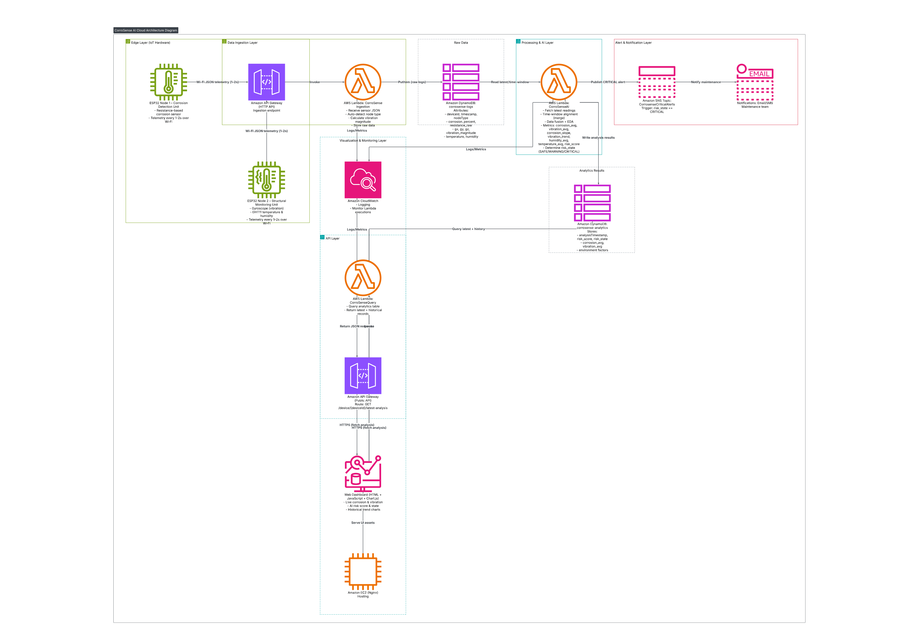

# 🏗️ CorroSense — IoT-Based Corrosion Intelligence Layer

> **DIPEX-2026 Project Submission**
> *Real-Time Sacrificial Corrosion Monitoring System for Critical Infrastructure*

---

## 📌 Overview

India's steel infrastructure faces a silent crisis: **hidden corrosion**. Bridges, pipelines, and dams deteriorate undetected until damage becomes irreversible. Traditional manual inspections are expensive, infrequent, and subjective — offering no real-time awareness.

**CorroSense** bridges this gap with a *"Corrosion Intelligence Layer"* — an autonomous, IoT-powered structural health monitoring system that converts physical material degradation into actionable digital data.

---

## 🎯 The Problem

- Steel infrastructure corrodes silently — invisible to the naked eye until it's too late
- Manual inspections are periodic and costly, with no ability to detect early-stage decay
- No scalable mechanism exists to quantify corrosion rate or predict structural health in real time
- Authorities react **after** failures, not before — putting lives and public funds at risk

---

## 💡 The Solution

CorroSense deploys **sacrificial metallic sticker sensors** (Flexible PCBs) directly onto steel assets. These sensors:

1. **Corrode at the same rate** as the host structure they're attached to
2. **Measure resistance change** as the metal track thins — based on the principle `R = ρ(L/A)`
3. **Transmit data wirelessly** over long-range LoRaWAN to a central cloud dashboard
4. **Trigger intelligent alerts** — categorised as `NORMAL`, `WARNING`, or `CRITICAL`

The result: a live health map of the structure, flagging failure-prone zones **months before visible damage appears**.

---

## 🏛️ System Architecture

The system operates across four key layers:

```
[Edge Hardware Layer]
      ↓ LoRaWAN (SX1278)
[Data Ingestion Layer]
      ↓ MQTT / Cloud
[Processing & AI Layer]
      ↓
[Dashboard & Alert Layer]
```

### Full Architecture Diagram



> *Architecture diagram showing the complete data flow from the IoT edge node through to the cloud analytics and alerting layer.*

---

## ⚙️ How It Works

### Sensing Principle
The sensor uses a **Serpentine Trace** pattern on a 3cm × 3cm Flexible PCB. This maximises track length within a small footprint, greatly increasing sensitivity to small amounts of corrosion.

### Signal Chain
```
Sacrificial FPCB Sensor
        ↓
Wheatstone Bridge Circuit (resistance measurement)
        ↓
Instrumentation Amplifier (signal boost)
        ↓
ESP32 ADC (digital conversion)
        ↓
Edge Processing (noise filter + threshold check)
        ↓
LoRa Radio (SX1278) → Gateway → Cloud
```

### Alert States

| State    | Condition                        | Action                        |
|----------|----------------------------------|-------------------------------|
| 🟢 SAFE     | Resistance within baseline       | Routine monitoring            |
| 🟡 WARNING  | ΔR > threshold (early corrosion) | Maintenance team notified     |
| 🔴 CRITICAL | ΔR > 20% loss                   | Immediate alert broadcast     |

---

## 📊 Live Dashboard

The **CorroSense Dashboard** provides a real-time web interface for infrastructure operators:

- **Live Metrics** — Corrosion Level (%), Risk Score, Vibration (Hz), Temperature, Humidity, Resistivity
- **Trend Analysis** — Historical multi-parameter chart (last 20 readings)
- **Daily Insights** — Average/max corrosion, vibration stats, and risk summary
- **Smart Recommendations** — AI-generated inspection guidance based on current sensor state
- **Auto-refresh** — Dashboard polls for new data every 5 seconds

### Dashboard Preview

| Component | Description |
|---|---|
| Status Badge | Real-time `SAFE / WARNING / CRITICAL` state |
| Metrics Grid | 6 live sensor parameters |
| Trend Chart | Multi-parameter line graph (Chart.js) |
| Insights Panel | Daily analysis summary + recommendation |

---

## 🔩 Technology Stack

### Hardware
| Component | Role |
|---|---|
| ESP32 (MCU) | Edge processing & WiFi/LoRa control |
| SX1278 (LoRa Module) | Long-range wireless transmission (10km+) |
| Flexible PCB Sensor | Sacrificial corrosion sensing element |
| Wheatstone Bridge Circuit | Precision resistance measurement |
| Instrumentation Amplifier | Differential signal conditioning |

### Software & Firmware
| Layer | Technology |
|---|---|
| Firmware | Arduino IDE (C++) |
| Backend | Cloud-based (serverless) |
| Transport | MQTT Protocol |
| Frontend | HTML5, CSS3, Vanilla JavaScript |
| Charts | Chart.js v4.4 |
| Local Dev Server | Python 3 (SimpleHTTPServer) |

---

## 🚀 Key Innovations

1. **Sacrificial Sensing** — Cheap, disposable sticker sensor mimics host metal, avoiding expensive ultrasonic equipment
2. **LoRaWAN Connectivity** — 10km+ range, works in remote locations with zero WiFi/cellular coverage (e.g., rural dams)
3. **Zero-Power Sleep Mode** — System sleeps 99% of the time; wakes hourly to sample, enabling **multi-year battery life**
4. **Predictive Analytics** — Tracks *rate* of corrosion to predict **Remaining Useful Life (RUL)** of the asset

---

## 📍 Application Areas

| Sector | Use Cases |
|---|---|
| 🏗️ Civil Infrastructure | Bridges, flyovers, railway girders |
| 🛢️ Oil & Gas | Surface pipelines, storage tanks, refineries |
| 🚢 Marine | Shipping containers, port cranes, offshore platforms |

---

## 📈 Impact

- **Prevents catastrophes** — early detection stops bridge collapses and pipeline failures
- **Reduces costs** — shifts from *schedule-based* to *condition-based* maintenance
- **Democratises monitoring** — at under ₹500/unit, enables mass deployment on Tier-2 and Tier-3 city infrastructure
- **Enables data-driven governance** — provides government bodies with a live "health report" of the city

---

## 🖥️ Running the Dashboard Locally

### Prerequisites
- Python 3.x installed
- A modern web browser

### Steps

```bash
# Clone the repository
git clone https://github.com/THE-S0HAM/corrosense.git
cd corrosense

# Start the local development server
python server.py
```

Then open your browser and navigate to:
```
http://localhost:8000
```

> **Note:** The live dashboard requires an active connection to the CorroSense cloud backend. Without it, metrics will display `--` until data is available.

---

## 📁 Project Structure

```
corrosense/
├── index.html        # Main dashboard UI
├── style.css         # Styling & responsive layout
├── script.js         # Dashboard logic & API integration
├── server.py         # Local development HTTP server
├── Image/
│   └── architecture.png  # System architecture diagram
└── README.md         # This file
```

---

## 🏆 Project Details

| Field | Details |
|---|---|
| **Competition** | DIPEX-2026 |
| **Registration No.** | DEG2026-0609 |
| **Theme** | Smart Infrastructure & Disaster Management |
| **Category** | IoT / Embedded Systems / Civil Tech |
| **Current Stage** | Working Prototype / Proof of Concept |
| **Project Type** | New solution to an old problem |

---

## 🥈 Achievement

> ### 🏆 1st Runner-Up — DIPEX 2026
> **CorroSense / InfraSense** was awarded the **1st Runner-Up Prize** at the **DIPEX 2026 Competition**, recognising its innovation in real-time structural health monitoring for critical infrastructure.

---

## 📄 License

This project was developed for **DIPEX-2026**. All rights reserved.
